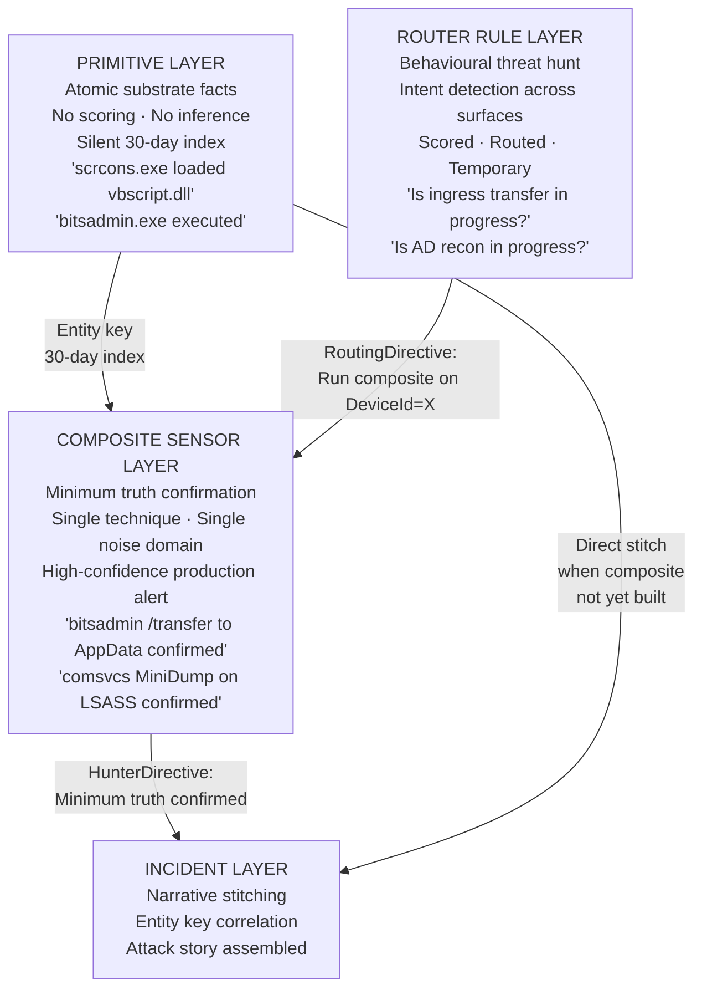
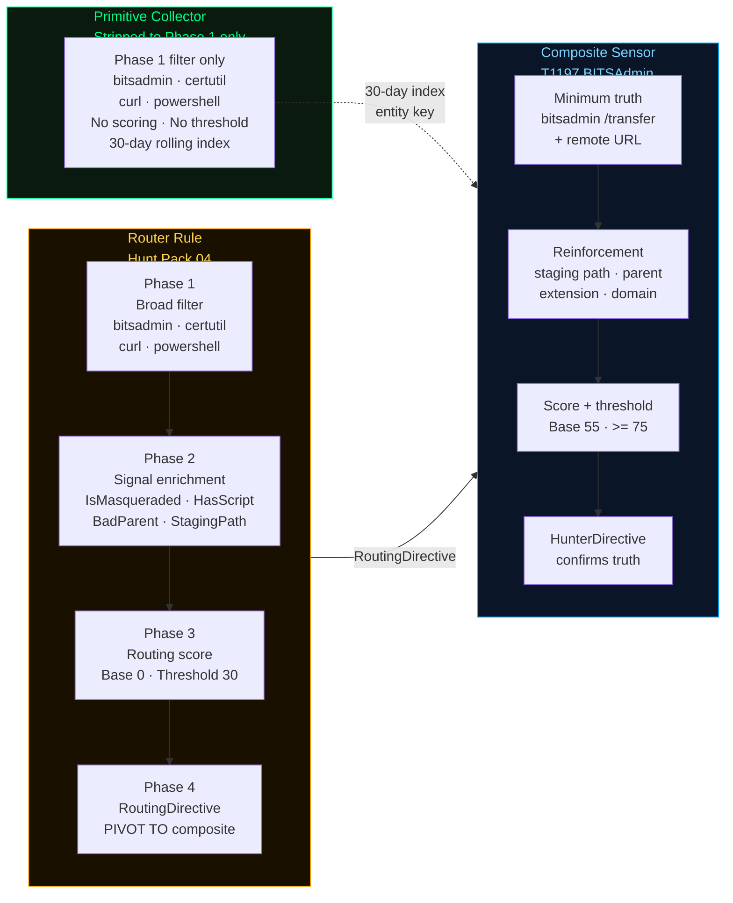
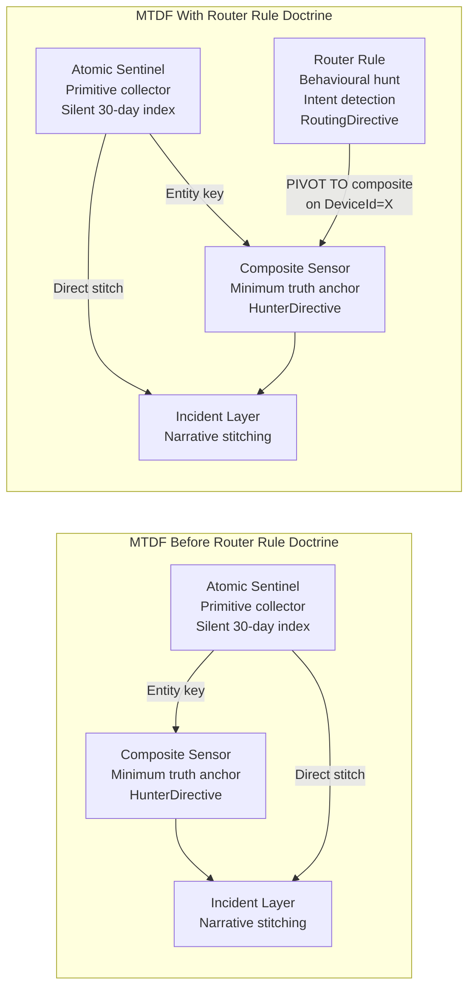
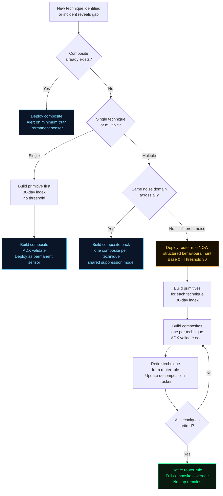
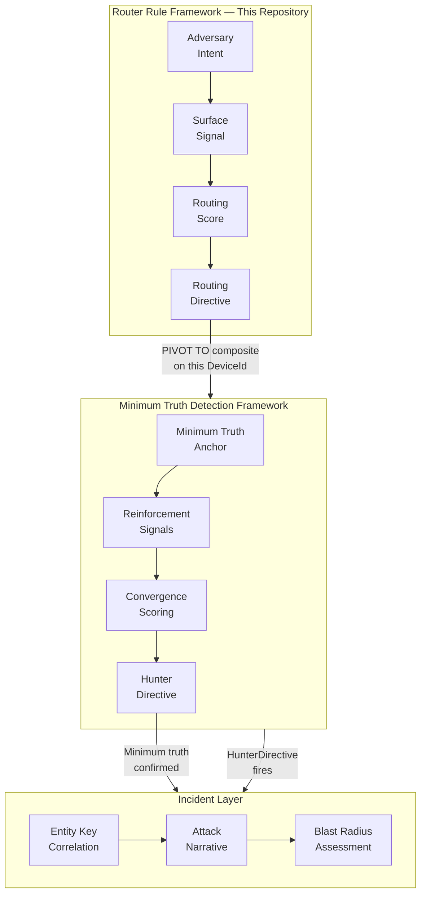
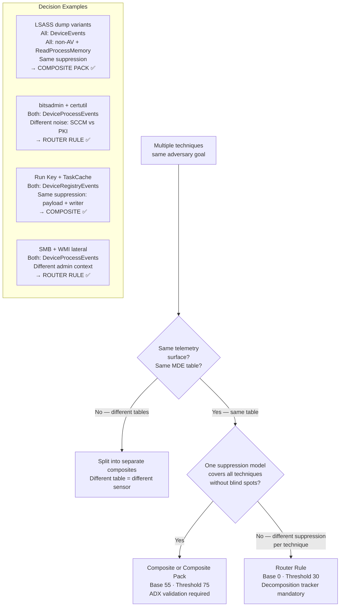
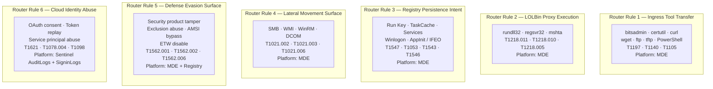
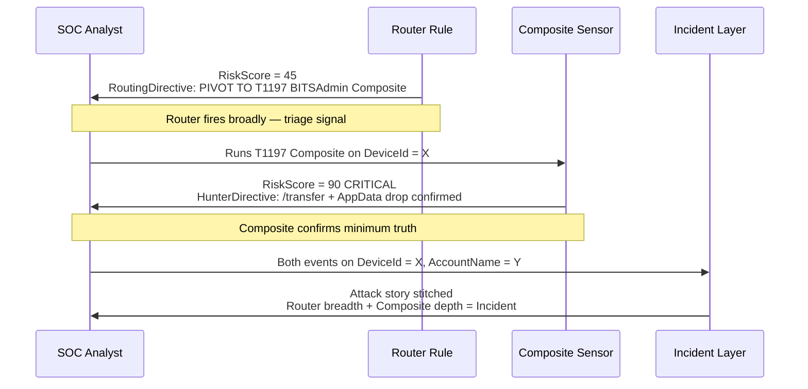
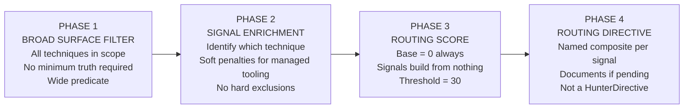
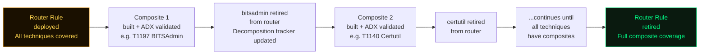

# Attack Narrative Pipeline — Router Rules Inclusive Framework
### How Sensors Become Incidents: The Router Rule Doctrine

**Author:** Ala Dabat | 2026  
**Parent Framework:** [Minimum Truth Detection Framework](https://github.com/azdabat/Minimum-Truth-Detection-Framework-ADX-Validated-Composite-Rules)  
**License:** [CC BY-NC-SA 4.0](https://creativecommons.org/licenses/by-nc-sa/4.0/legalcode)

---

> *"Composite sensors confirm truth.*  
> *Router rules detect intent.*  
> *The gap between them is not a failure — it is an engineering backlog.*  
> *The router rule is the honest admission that the composite does not exist yet,*  
> *and the architectural commitment that it will."*

---

## Router Rules vs Primitives — The Three-Layer Detection Architecture

> *"A primitive captures what happened.*  
> *A router rule asks whether it matters.*  
> *A composite confirms that it does."*

---

### Primitives Are Atomic

A primitive is the irreducible telemetric fact. It answers one question with zero inference:

```
scrcons.exe loaded vbscript.dll
bitsadmin.exe executed
rundll32.exe invoked comsvcs.dll
```

No scoring. No context. No intent. Just the raw substrate event captured and indexed. Primitives live in the **atomic sentinel layer** — the silent 30-day rolling index that catches what composites miss and connects Day 0 staging to Day 3 activation.

---

### Router Rules Are Behavioural Threat Hunts

A router rule is a behavioural hunt that has been given structure, a scoring model, and a routing output. It asks a higher-order question than a primitive:

```
Is there evidence of ingress transfer intent anywhere on this estate?
Is there evidence of AD reconnaissance activity anywhere on this estate?
Is there evidence of script proxy execution intent anywhere on this estate?
```

These are hunt hypotheses expressed as always-on rules. The four-phase MTDF structure, the convergence scoring, the soft penalties, the routing directive — all of that is behavioural analysis, not raw telemetry capture. A router rule is operationally a threat hunt that has been promoted to a scheduled detection.

---

### The Three-Layer Model



---

### The Practical Distinction

| Layer | Question Asked | Output | Lifecycle |
|-------|---------------|--------|-----------|
| **Primitive** | Did this substrate event exist? | Raw indexed fact | Permanent |
| **Router Rule** | Is this adversary goal in progress? | RoutingDirective | Temporary |
| **Composite Sensor** | Did this specific attack happen? | HunterDirective | Permanent |
| **Incident Layer** | What is the full attack story? | Narrative + blast radius | Case lifecycle |

---

### What Happens When You Strip a Router Rule Down

Strip the scoring, remove the routing, remove the phase structure, keep only the Phase 1 filter — you get a primitive collector. That is literally what the atomic sentinel layer is built from.

The Phase 1 broad surface filter of Hunt Pack 04 (Ingress Tool Transfer), run with no threshold and no scoring, becomes a primitive index of every LOLBin downloader execution on the estate for the last 30 days.



That is architecturally valid and useful — but it serves a different purpose. The primitive index is the net. The router rule is the structured hunt. The composite is the anchor.

---

### The Insight That Connects All Three

The MTDF framework already implicitly contained all three layers:



The router rule fills the **gap between primitive and composite** — it is the structured behavioural hunt that surfaces intent across technique families while the composites are being built to confirm truth.

---

### The Coverage Pipeline in Full



---

### Summary

```
Primitive    → the substrate event, indexed, no inference
Router Rule  → the behavioural hunt, structured, intent-level, temporary
Composite    → the minimum truth confirmation, permanent, high-confidence
Incident     → the narrative, assembled from all three

Strip a router rule to Phase 1 only → primitive collector
Promote a router rule technique to ADX-validated anchor → composite sensor
A router rule that is never retired → coverage debt
A composite without a primitive backing it → gap in the 30-day index
```

> **The primitive is the net.**  
> **The router rule is the structured hunt.**  
> **The composite is the anchor.**  
> **The incident is the story.**


```
╔══════════════════════════════════════════════════════════════════════════════╗
║               ATTACK NARRATIVE PIPELINE — ROUTER RULE FRAMEWORK             ║
║                                                                              ║
║   Adversary Intent  ──▶  Surface Signal  ──▶  Routing Directive             ║
║                    ──▶  Composite Fires  ──▶  Incident Narrates             ║
║                                                                              ║
║   Router Rule  = Coverage Bridge    Composite  = Truth Anchor               ║
║   Different Noise = Split           Same Noise = Combine                    ║
║                                                                              ║
║   The router detects. The composite confirms. The incident narrates.        ║
╚══════════════════════════════════════════════════════════════════════════════╝
```

---

## Table of Contents

- [What This Repository Is](#what-this-repository-is)
- [How This Relates to the MTDF](#how-this-relates-to-the-mtdf)
- [The Core Doctrine](#the-core-doctrine)
- [Repository Contents](#repository-contents)
- [The Six Router Rules — Coverage Overview](#the-six-router-rules--coverage-overview)
- [The Architecture at a Glance](#the-architecture-at-a-glance)
- [When to Use a Router Rule vs a Composite](#when-to-use-a-router-rule-vs-a-composite)
- [The Decomposition Pipeline](#the-decomposition-pipeline)
- [Operational Notes](#operational-notes)

---

## What This Repository Is

This repository documents the **Router Rule Framework** — a parallel architectural doctrine to the [Minimum Truth Detection Framework](https://github.com/azdabat/Minimum-Truth-Detection-Framework-ADX-Validated-Composite-Rules) that governs how detection engineers handle attack surfaces that span multiple techniques with incompatible noise domains.

Where the MTDF governs the construction of high-confidence composite sensors — rules that confirm a specific minimum truth with a scored, directed output — the Router Rule Framework governs the construction of surface aggregators: wide, low-cost rules that detect adversary intent across multiple techniques and route analysts to the correct ecosystem composite for confirmation.

**This is not a collection of placeholder rules.** Every rule in this repository is a production-engineered detection with full architectural justification, a mandatory decomposition tracker, and a RoutingDirective that names the composite sensor the analyst should run next. The rules are temporary by design — each technique they cover has a composite being built in parallel, and each rule is retired as those composites are ADX-validated.

---

## How This Relates to the MTDF



The two frameworks operate at different layers of the detection estate and are designed to work together, not compete:

| Property | MTDF Composite Sensor | Router Rule Framework |
|----------|----------------------|----------------------|
| Claim | "This specific attack exists" | "This adversary goal is in progress" |
| Evidence required | Irreducible structural proof | Convergence of intent signals |
| Base score | 55 — truth already elevated | 0 — signals build from nothing |
| Threshold | ≥ 75 — production alert | ≥ 30 — triage surface |
| Output | HunterDirective | RoutingDirective |
| Analyst action | Investigate this finding | Run the composite on this DeviceId |
| Lifecycle | Permanent once ADX validated | Temporary — retired when composites exist |
| False negative risk | Low — anchored on minimum truth | Higher — broad surface may miss depth |
| False positive risk | Low — scored + threshold gated | Higher — intentionally broader |

---

## The Core Doctrine

### The Noise Domain Test

One question determines whether you build a composite sensor or a router rule:

> **"Can I write one suppression model that covers all techniques in scope without creating blind spots in any of them?"**



### The Two Non-Negotiable Scoring Rules

These are hard rules. Neither has exceptions.

```
ROUTER RULE:      Base score = 0   ALWAYS.   Threshold = ≤ 30  ALWAYS.
COMPOSITE SENSOR: Base score = 55  ALWAYS.   Threshold = ≥ 75  ALWAYS.
```

| Violation | Consequence |
|-----------|-------------|
| Router rule at base 55 | Rule cannot be tuned — scores are not comparable across techniques with different noise profiles |
| Composite sensor at base 0 | Minimum truth is not acknowledged — the rule has no anchor and will produce inconsistent results |

---

## Repository Contents

```
Attack-Narrative-Pipeline-How-Sensors-Become-Incidents/
│
├── README.md                          ← This file
│
├── Router Rules Inclusive Framework.md ← Master framework document
│   ├── Part I   — Philosophy
│   ├── Part II  — The Core Decision
│   ├── Part III — Architecture
│   ├── Part IV  — The Noise Domain Test
│   ├── Part V   — Router Rule 1: Ingress Tool Transfer
│   ├── Part VI  — Router Rule 2: LOLBin Proxy Execution
│   ├── Part VII — Router Rule 3: Registry Persistence Intent
│   ├── Part VIII— Router Rule 4: Lateral Movement Surface
│   ├── Part IX  — Router Rule 5: Defense Evasion Surface
│   ├── Part X   — Router Rule 6: Cloud Identity Abuse Surface
│   ├── Part XI  — The Decomposition Pipeline
│   └── Part XII — Router Rule Checklist
│
└── [Individual rule files — coming as composites are built]
    ├── T1197_BITSAdmin_Composite.kql      ← Retires bitsadmin from Router 1
    ├── T1140_Certutil_Composite.kql       ← Retires certutil from Router 1
    ├── T1218_011_Rundll32_Composite.kql   ← Retires rundll32 from Router 2
    ├── T1218_010_Regsvr32_Composite.kql   ← Retires regsvr32 from Router 2
    ├── T1218_005_Mshta_Composite.kql      ← Retires mshta from Router 2
    └── ...
```

---

## The Six Router Rules — Coverage Overview



### Coverage Status at a Glance

| Router Rule | Techniques | Built Composites | Pending Composites | Status |
|-------------|-----------|-----------------|-------------------|--------|
| Ingress Tool Transfer | 7 | 2 (bitsadmin, PowerShell) | 5 | 🟡 Active |
| LOLBin Proxy Execution | 3 | 0 | 3 | 🔴 Active — all pending |
| Registry Persistence | 5 | 2 (Run Key, TaskCache) | 3 | 🟡 Active |
| Lateral Movement | 4 | 0 (1 partial) | 4 | 🔴 Active — mostly pending |
| Defense Evasion | 4 | 0 | 4 | 🔴 Active — all pending |
| Cloud Identity | 3 | 1 (OAuth consent) | 2 | 🟡 Active |

---

## The Architecture at a Glance

### How a Router Rule and Composite Work Together



### The Four-Phase Router Rule Structure



---

## When to Use a Router Rule vs a Composite

### The Noise Domain Table — Why Some Tools Cannot Share a Composite

| Tool / Technique | Legitimate Enterprise Noise | Suppression Required | Conflicts With |
|-----------------|----------------------------|---------------------|----------------|
| `bitsadmin.exe` | SCCM, Windows Update, Intune MDM | Exclude managed endpoint lineage | certutil — incompatible context |
| `certutil.exe` | PKI ops, cert renewal, code signing | Exclude dev/PKI workflows | bitsadmin — different entirely |
| `curl.exe` | DevOps CI/CD, API testing, containers | Exclude CI/CD runner accounts | Both above — completely different |
| `rundll32.exe` | COM activation, print spooler, DLL reg | Exclude spoolsv/dllhost parent | regsvr32 — different parent noise |
| `regsvr32.exe` | Software install, COM registration | Exclude msiexec parent, publisher | mshta — different install context |
| `mshta.exe` | Legacy HTA, Group Policy logon scripts | Exclude known HTA path, signed | Both above — entirely different |
| SMB lateral | Admin shares, domain operations | Exclude DC-to-DC, known admins | WMI — different port and context |
| WMI lateral | WMI management, monitoring platforms | Exclude known WMI providers | SMB — completely different infra |

### Examples That Should NOT Be Router Rules

These are composite sensors or composite packs — same suppression model, different technique count is irrelevant:

| Techniques | Why Composite Is Correct |
|-----------|--------------------------|
| LSASS MiniDump + ProcDump + Task Manager dump | All: DeviceEvents, all: non-AV process opening LSASS. Same suppression. |
| WMI fileless + WMI remote exec | Different tables (DeviceImageLoadEvents vs DeviceProcessEvents). Split composites. |
| Registry Run Key + TaskCache | Both: DeviceRegistryEvents, same suppression: trusted publisher + safe payload. |
| PowerShell `-Enc` + IEX + AMSI bypass | Same binary, same table, same suppression. One composite covers all primitives. |

---

## The Decomposition Pipeline

A router rule is legitimate only when every technique it covers has a composite being built in parallel. The decomposition tracker is the engineering commitment that makes it so.



### Master Decomposition Tracker

| Router Rule | Technique | Composite | Status | Action |
|-------------|-----------|-----------|--------|--------|
| Ingress Transfer | bitsadmin /transfer | T1197 BITSAdmin | ✅ Built | **RETIRE from router** |
| Ingress Transfer | PowerShell cradle | T1059.001 PowerShell | ✅ Built | **RETIRE from router** |
| Ingress Transfer | certutil -urlcache | T1140 Certutil | 🔴 Pending | Keep in router |
| Ingress Transfer | curl / wget | T1105 curl | 🔴 Not built | Keep in router |
| Ingress Transfer | ftp / tftp | None | 🔴 Not planned | Keep in router |
| Ingress Transfer | IsMasqueraded | T1036 Masquerade | 🔴 Pending | Keep in router |
| LOLBin Proxy | rundll32.exe | T1218.011 | 🔴 Pending | Keep in router |
| LOLBin Proxy | regsvr32.exe | T1218.010 | 🔴 Pending | Keep in router |
| LOLBin Proxy | mshta.exe | T1218.005 | 🔴 Pending | Keep in router |
| Registry Persistence | Run key | T1547.001 | ✅ Built | **Route to composite** |
| Registry Persistence | TaskCache | T1053.005 | ✅ Built | **Route to composite** |
| Registry Persistence | Services ImagePath | T1543.003 | ⚠️ Partial | Route + investigate |
| Registry Persistence | Winlogon/Shell | T1547.004 | 🔴 Pending | Keep in router |
| Registry Persistence | AppInit/IFEO | T1546.010 | 🔴 Pending | Keep in router |
| Lateral Movement | SMB service exec | T1021.002 | ⚠️ Partial | Route + investigate |
| Lateral Movement | WMI remote exec | T1021.003 | 🔴 Pending | Keep in router |
| Lateral Movement | WinRM exec | T1021.006 | 🔴 Pending | Keep in router |
| Lateral Movement | DCOM execution | T1021.003v | 🔴 Pending | Keep in router |
| Defense Evasion | Security product kill | T1562.001 | 🔴 Pending | Keep in router |
| Defense Evasion | Exclusion abuse | T1562.001v | 🔴 Pending | Keep in router |
| Defense Evasion | AMSI bypass | T1562.002 | 🔴 Pending | Keep in router |
| Defense Evasion | ETW disable | T1562.006 | 🔴 Pending | Keep in router |
| Cloud Identity | OAuth consent | T1621 | ✅ Built | **Route to composite** |
| Cloud Identity | Token replay | T1078.004 | 🔴 Pending | Keep in router |
| Cloud Identity | Service principal | T1098 | 🔴 Pending | Keep in router |

---

## Operational Notes

> [!NOTE]
> **Platform Coverage**  
> Rules 1–5 target MDE Advanced Hunting (KQL). Rule 6 targets Microsoft Sentinel (AuditLogs + SigninLogs). All rules follow the same four-phase structure — only the table names and field references change per platform.

> [!NOTE]
> **Integration with the MTDF**  
> Every RoutingDirective in these rules references a composite sensor from the [Minimum Truth Detection Framework](https://github.com/azdabat/Minimum-Truth-Detection-Framework-ADX-Validated-Composite-Rules). Router rules and composite sensors are designed to operate together — the router surfaces breadth, the composite confirms depth, the incident layer stitches both via entity keys (`DeviceId`, `AccountName`, `DeviceName`).

> [!IMPORTANT]
> **Not "Plug-and-Play"**  
> These router rules require noise calibration in your tenant before production deployment. The soft down-score penalties (managed tooling, trusted parents) must be validated against your specific administrative context. Run each rule in query mode with `| limit 100` first to review the top-scoring events before setting a scheduled alert.

> [!IMPORTANT]
> **The Non-Negotiable Scoring Rules**  
> Router rule base score is always 0. Threshold is always ≤ 30. These are not guidelines — they are architectural constraints. A router rule at base 55 cannot be correctly tuned because the scores are not comparable across techniques with different noise profiles. A router rule at threshold 75 is not a router rule — it is a broken composite.

---

```
╔══════════════════════════════════════════════════════════════════════════════╗
║                         FINAL PRINCIPLE                                     ║
║                                                                              ║
║  Router rules exist because composites take time to build.                  ║
║  They are legitimate, engineered, and architecturally sound.                ║
║  They are never permanent.                                                   ║
║                                                                              ║
║  The noise domain is the deciding factor — not technique count.             ║
║  One suppression model across all techniques → composite.                   ║
║  Different suppression model per technique → router rule.                   ║
║                                                                              ║
║  The decomposition tracker is the engineering commitment                    ║
║  that makes the router rule legitimate.                                      ║
║                                                                              ║
║  Router rules detect intent.                                                 ║
║  Ecosystem composites confirm truth.                                         ║
║  The incident layer narrates the story.                                      ║
║  The pivot is not a defence. It is a data point.                            ║
╚══════════════════════════════════════════════════════════════════════════════╝
```

---

*Author: Ala Dabat | [github.com/azdabat](https://github.com/azdabat)*  
*Parent Framework: [Minimum Truth Detection Framework](https://github.com/azdabat/Minimum-Truth-Detection-Framework-ADX-Validated-Composite-Rules)*  
*Licensed under [CC BY-NC-SA 4.0](https://creativecommons.org/licenses/by-nc-sa/4.0/legalcode)*  
*Attribution required · Non-commercial use only · ShareAlike*
