# The Router Rule Framework
### A Parallel Doctrine to the Minimum Truth Detection Framework

**Author:** Ala Dabat | 2026  
**Parent Framework:** [Minimum Truth Detection Framework](https://github.com/azdabat/Minimum-Truth-Detection-Framework-ADX-Validated-Composite-Rules)  
**License:** [CC BY-NC-SA 4.0](https://creativecommons.org/licenses/by-nc-sa/4.0/legalcode)

---

> *"Composite sensors confirm truth.*  
> *Router rules detect intent.*  
> *The gap between them is not a failure — it is an engineering backlog.*  
> *The router rule is the honest admission that the composite does not exist yet,*  
> *and the architectural commitment that it will."*

---

```
╔══════════════════════════════════════════════════════════════════════════════╗
║                      THE ROUTER RULE FRAMEWORK                               ║
║                                                                              ║
║   Adversary Intent  ──▶  Surface Signal  ──▶  Routing Directive             ║
║                                                                              ║
║   Router Rule = Coverage Bridge     Composite = Truth Anchor                ║
║   Different Noise = Split           Same Noise = Combine                    ║
║                                                                              ║
║   The router detects. The composite confirms. The incident narrates.        ║
╚══════════════════════════════════════════════════════════════════════════════╝
```

---

## Table of Contents

- [Part I — Philosophy](#part-i--philosophy)
- [Part II — The Core Decision](#part-ii--the-core-decision)
- [Part III — Architecture](#part-iii--architecture)
- [Part IV — The Noise Domain Test](#part-iv--the-noise-domain-test)
- [Part V — Router Rule 1: Ingress Tool Transfer](#part-v--router-rule-1-ingress-tool-transfer)
- [Part VI — Router Rule 2: LOLBin Proxy Execution](#part-vi--router-rule-2-lolbin-proxy-execution)
- [Part VII — Router Rule 3: Registry Persistence Intent](#part-vii--router-rule-3-registry-persistence-intent)
- [Part VIII — Router Rule 4: Lateral Movement Surface](#part-viii--router-rule-4-lateral-movement-surface)
- [Part IX — Router Rule 5: Defense Evasion Surface](#part-ix--router-rule-5-defense-evasion-surface)
- [Part X — Router Rule 6: Cloud Identity Abuse Surface](#part-x--router-rule-6-cloud-identity-abuse-surface)
- [Part XI — The Decomposition Pipeline](#part-xi--the-decomposition-pipeline)
- [Part XII — Router Rule Checklist](#part-xii--router-rule-checklist)

---

## Part I — Philosophy

### What a Router Rule Is

A router rule is not a compromise. It is not a lazy composite. It is not a placeholder.

A router rule is the precise engineering response to a specific architectural condition: **multiple attack techniques sharing the same adversary goal but living in different noise domains**, where combining them into a single composite sensor would require suppression logic so broad that it creates exploitable blind spots.

The router rule acknowledges that breadth and depth are different engineering problems, solved by different architectures, operating at different layers of the detection estate.

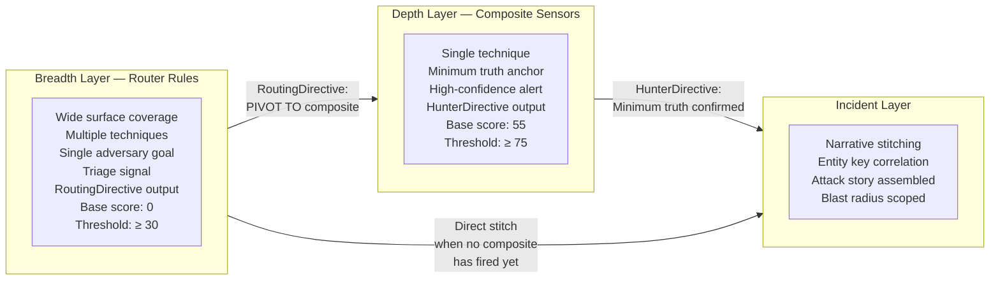

### The Parallel to Minimum Truth

The Minimum Truth Detection Framework asks: *what is the irreducible condition that must be true for this attack to exist?*

The Router Rule Framework asks: *what is the irreducible condition that must be true for this adversary goal to be in progress — regardless of which specific technique was chosen?*

Both frameworks start with the same epistemic commitment: **do not assert more certainty than the evidence provides.** A composite sensor that fires asserts minimum truth. A router rule that fires asserts adversary intent. These are different claims, requiring different evidence thresholds, producing different analyst actions.

| Property | Minimum Truth (Composite) | Adversary Intent (Router) |
|----------|--------------------------|--------------------------|
| Claim | "This specific attack exists" | "This adversary goal is in progress" |
| Evidence | Irreducible structural proof | Convergence of intent signals |
| Base score | 55 — truth already elevated | 0 — signals build from nothing |
| Threshold | ≥ 75 — high confidence | ≥ 30 — triage surface |
| Output | HunterDirective | RoutingDirective |
| Analyst action | Investigate this finding | Run the composite on this DeviceId |
| Lifecycle | Permanent — ADX validated | Temporary — retired when composites exist |

### Why Router Rules Are Not Permanent

A router rule that is never retired is evidence that composites were never built. That is not a detection engineering achievement — it is a coverage debt that has been institutionalised.

Every technique in a router rule must have a composite being engineered in parallel. The decomposition tracker is not bureaucracy. It is the engineering commitment that gives the router rule its architectural legitimacy.

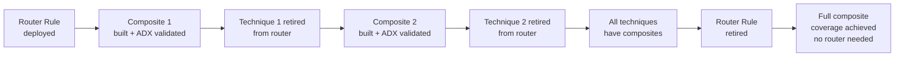

---

## Part II — The Core Decision

### The Noise Domain Test

This is the single question that determines whether you build a composite or a router rule:

> **"Can I write one suppression model that covers all techniques in scope without creating blind spots in any of them?"**

If yes — composite sensor or composite pack.  
If no — router rule.

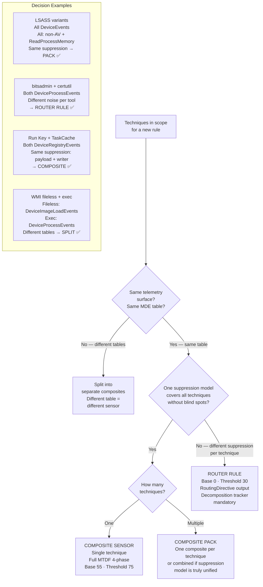

### The Practical Test

For any proposed composite covering multiple techniques, ask this about each combination:

```
If I add [technique B] suppression to my [technique A] composite:
Does [technique B] legitimate noise look like [technique A] attack behaviour?
Does [technique A] legitimate noise look like [technique B] attack behaviour?

If YES to either → different noise domains → ROUTER RULE
If NO to both   → same noise domain → COMPOSITE or PACK
```

---

## Part III — Architecture

### Structural Requirements

Every router rule must contain exactly these four components:

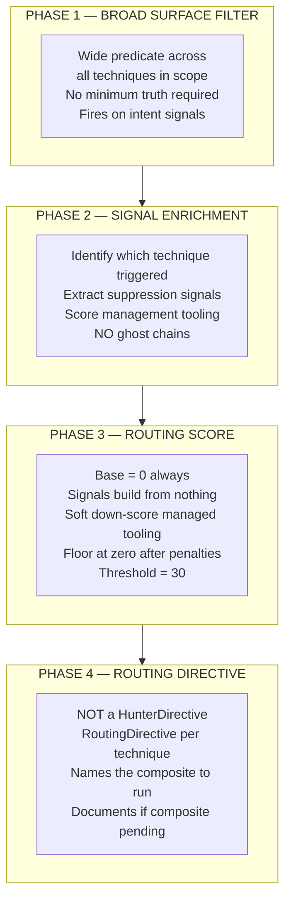

### Scoring Model

```kql
// ── ROUTER RULE SCORING PATTERN ─────────────────────────────────────────────
// Base always starts at ZERO
// Signals build the case incrementally
// Management tooling receives soft penalty — never hard exclusion
// Floor score at zero — negative scores have no meaning

| extend RawScore = 0
    + iff(StrongSignal == 1,   50, 0)   // Binary identity mismatch, renamed binary
    + iff(MedSignal == 1,      25, 0)   // Script + download chain
    + iff(WeakSignal == 1,     15, 0)   // Suspicious parent
    + iff(ContextSignal == 1,  10, 0)   // Staging path, writable location
    - iff(ManagedContext == 1, 15, 0)   // Soft penalty: managed tooling
| extend RiskScore = iif(RawScore < 0, 0, RawScore)
| where RiskScore >= 30   // TRIAGE threshold — never >= 75
```

### The Decomposition Tracker (mandatory in every router rule header)

```kql
// DECOMPOSITION STATUS:
// ┌──────────────────────┬─────────────────────────────┬──────────────────────┐
// │ Technique            │ Composite Status             │ Action               │
// ├──────────────────────┼─────────────────────────────┼──────────────────────┤
// │ [technique]          │ [name] — BUILT ✅            │ RETIRE from router   │
// │ [technique]          │ [name] — pending 🔴          │ Keep in router       │
// │ [technique]          │ No composite planned         │ Keep in router       │
// └──────────────────────┴─────────────────────────────┴──────────────────────┘
```

---

## Part IV — The Noise Domain Test

### Why These Tools Cannot Share a Composite

This table is the empirical basis for every router rule in this framework. Read it before questioning whether a composite is possible.

| Tool / Technique | Legitimate Enterprise Noise | Suppression Required | Conflict With |
|-----------------|----------------------------|----------------------|---------------|
| `bitsadmin.exe` | SCCM deployments, Windows Update, Intune MDM | Exclude managed endpoint lineage, SYSTEM context | certutil — different context entirely |
| `certutil.exe` | PKI operations, cert renewal, code signing validation | Exclude dev machine context, IT PKI workflows | bitsadmin — suppression incompatible |
| `curl.exe` | DevOps CI/CD, REST API testing, container build pipelines | Exclude CI/CD runner context, build agent accounts | Both above — completely different |
| `rundll32.exe` | COM activation, print spooler, DLL registration, shell ops | Exclude spoolsv/dllhost parent, system DLL source | regsvr32 — different parent noise |
| `regsvr32.exe` | Software installation, COM registration, app deployment | Exclude msiexec/setup parent, signed publisher | mshta — different installation context |
| `mshta.exe` | Legacy enterprise HTA, Group Policy logon scripts | Exclude known HTA path, signed HTA source | Both above — entirely different |
| Registry Run Key | Software installers, update agents, security tools | Exclude trusted publisher + safe path + safe payload | AppInit — debugging/AV conflict |
| Registry AppInit | Debugging tools, AV software, compatibility shims | Exclude debugger path, AV publisher | Run Key — suppression breaks AV detection |
| SMB lateral | Admin file shares, domain operations | Exclude DC-to-DC, known admin accounts | WMI — different infra noise profile |
| WMI lateral | WMI management operations, monitoring | Exclude known monitoring accounts, WMI providers | SMB — completely different port/context |

---

## Part V — Router Rule 1: Ingress Tool Transfer

**Adversary goal:** Stage a payload or tool from an external source onto a target host.  
**Why a router rule:** Seven LOLBin downloaders, seven different enterprise noise profiles.

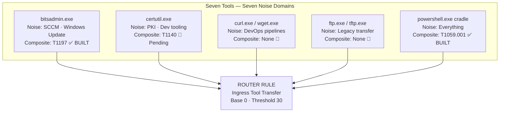

```kql
// ============================================================================
// ROUTER RULE 1: Ingress Tool Transfer — Evasion-Aware Surface
// Architecture : Router Rule — Triage Surface
// Author       : Ala Dabat | MTDF 2026
// Lifecycle    : Router (Temporary)
// Platform     : MDE Advanced Hunting
//
// DECOMPOSITION STATUS:
// ┌──────────────────────┬─────────────────────────────┬──────────────────────┐
// │ Technique            │ Composite Status             │ Action               │
// ├──────────────────────┼─────────────────────────────┼──────────────────────┤
// │ bitsadmin /transfer  │ T1197 Composite — BUILT ✅   │ RETIRE from router   │
// │ certutil -urlcache   │ T1140 Composite — pending 🔴 │ Keep in router       │
// │ curl / wget -o       │ No composite yet             │ Keep in router       │
// │ ftp / tftp transfer  │ No composite planned         │ Keep in router       │
// │ PowerShell cradle    │ T1059.001 — BUILT ✅         │ RETIRE from router   │
// │ IsMasqueraded signal │ T1036 Masquerade — pending 🔴│ Keep in router       │
// └──────────────────────┴─────────────────────────────┴──────────────────────┘
// ============================================================================

let lookback = 7d;
let TargetProcs = dynamic([
    "certutil.exe","bitsadmin.exe","curl.exe","wget.exe",
    "ftp.exe","tftp.exe","powershell.exe"
]);
let SuspiciousParents = dynamic([
    "cmd.exe","winword.exe","excel.exe","outlook.exe",
    "wscript.exe","cscript.exe","mshta.exe"
]);
let SuspiciousDirs = dynamic([
    "\\Users\\Public","\\ProgramData","\\Windows\\Temp","\\Temp",
    "\\Downloads","\\AppData\\Local\\Temp","\\AppData\\Roaming"
]);
let ManagedParents = dynamic([
    "ccmexec.exe","intunemanagementextension.exe","wuauclt.exe"
]);

// ── PHASE 1: BROAD SURFACE FILTER ──────────────────────────────────────────
DeviceProcessEvents
| where Timestamp > ago(lookback)
| extend
    FileLower = tolower(FileName),
    OrigLower = tolower(tostring(column_ifexists("ProcessVersionInfoOriginalFileName",""))),
    HasOrig   = isnotempty(tolower(tostring(
                    column_ifexists("ProcessVersionInfoOriginalFileName",""))))
| where FileLower in~ (TargetProcs) or (HasOrig and OrigLower in~ (TargetProcs))
| where ProcessCommandLine has_any (
    "http","https","ftp",
    "-urlcache","-split","-f","decode",
    "/transfer","/addfile","/setnotifycmdline","/resume",
    " -o "," --output "," -OutFile ","--remote-name",
    "invoke-webrequest","iwr","invoke-restmethod","irm",
    "downloadstring","new-object net.webclient"
)

// ── PHASE 2: SIGNAL ENRICHMENT ──────────────────────────────────────────────
| extend
    IsMasqueraded   = toint(HasOrig and FileLower != OrigLower),
    HasScript       = toint(ProcessCommandLine has_any (
                        "downloadstring","iex","-enc","frombase64string")),
    BadDLLPath      = toint(ProcessCommandLine has ".dll"
                        and ProcessCommandLine has_any (SuspiciousDirs)),
    BadParent       = toint(InitiatingProcessFileName in~ (SuspiciousParents)),
    IsStagingPath   = toint(ProcessCommandLine has_any (SuspiciousDirs)),
    IsManagedParent = toint(InitiatingProcessFileName in~ (ManagedParents))

// ── PHASE 3: ROUTING SCORE ──────────────────────────────────────────────────
| extend RawScore = 0
    + iff(IsMasqueraded == 1,   50, 0)
    + iff(HasScript == 1,       25, 0)
    + iff(BadDLLPath == 1,      20, 0)
    + iff(BadParent == 1,       15, 0)
    + iff(IsStagingPath == 1,   10, 0)
    - iff(IsManagedParent == 1, 15, 0)
| extend RiskScore = iif(RawScore < 0, 0, RawScore)
| where RiskScore >= 30

// ── PHASE 4: ROUTING DIRECTIVE ──────────────────────────────────────────────
| extend RoutingDirective = case(
    IsMasqueraded == 1,
        "CRITICAL → T1036 Masquerading Composite | Renamed LOLBin confirmed",
    FileLower =~ "bitsadmin.exe",
        "HIGH → T1197 BITSAdmin Composite | Composite built — run it",
    FileLower =~ "certutil.exe",
        "HIGH → T1140 Certutil Composite | Composite pending — investigate",
    FileLower in~ ("curl.exe","wget.exe"),
        "HIGH → No composite yet | Build T1105 curl composite",
    HasScript == 1,
        "HIGH → T1059.001 PowerShell Composite | Composite built — run it",
    FileLower in~ ("ftp.exe","tftp.exe"),
        "MEDIUM → No composite | Legacy transfer — investigate",
    "MEDIUM → Investigate ingress transfer intent"
)
| summarize arg_max(Timestamp, *) by DeviceId, AccountName, FileName
| project Timestamp, DeviceName, AccountName, FileName,
          ProcessCommandLine, InitiatingProcessFileName,
          RiskScore, IsMasqueraded, HasScript, BadParent,
          IsStagingPath, RoutingDirective
| sort by RiskScore desc
```

---

## Part VI — Router Rule 2: LOLBin Proxy Execution

**Adversary goal:** Execute arbitrary code through a trusted, signed Windows binary.  
**Why a router rule:** Three binaries, three completely different enterprise contexts.

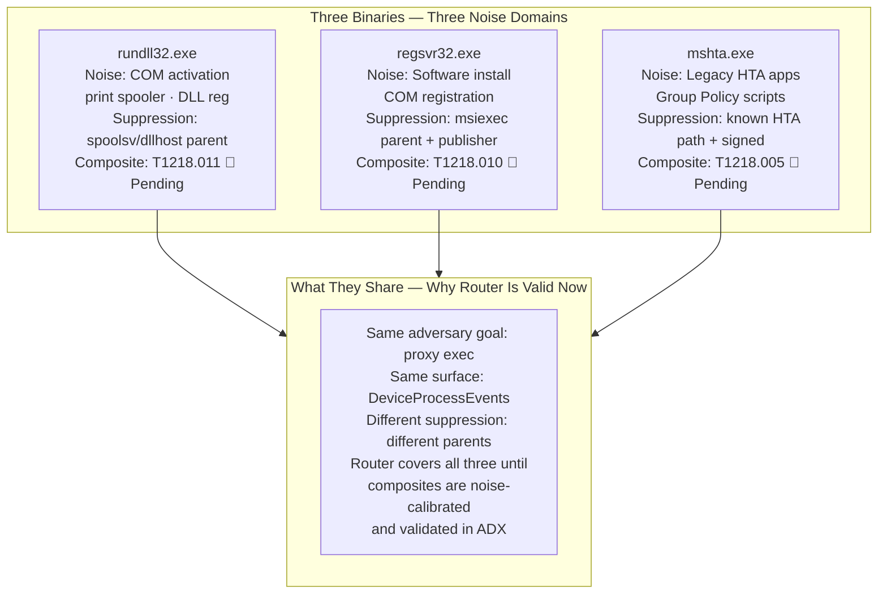

```kql
// ============================================================================
// ROUTER RULE 2: LOLBin Proxy Execution Surface
// Architecture : Router Rule — Triage Surface
// Author       : Ala Dabat | MTDF 2026
// Lifecycle    : Router (Temporary)
// Platform     : MDE Advanced Hunting
//
// DECOMPOSITION STATUS:
// ┌──────────────────────┬─────────────────────────────┬──────────────────────┐
// │ Technique            │ Composite Status             │ Action               │
// ├──────────────────────┼─────────────────────────────┼──────────────────────┤
// │ rundll32 proxy exec  │ T1218.011 — pending 🔴       │ Keep in router       │
// │ regsvr32 squiblydoo  │ T1218.010 — pending 🔴       │ Keep in router       │
// │ mshta.exe proxy      │ T1218.005 — pending 🔴       │ Keep in router       │
// └──────────────────────┴─────────────────────────────┴──────────────────────┘
// ============================================================================

let lookback = 7d;
let ProxyBinaries       = dynamic(["rundll32.exe","regsvr32.exe","mshta.exe"]);
let SafeRundll32Parents = dynamic(["spoolsv.exe","dllhost.exe","svchost.exe"]);
let SafeRegsvr32Parents = dynamic(["msiexec.exe","setup.exe","install.exe"]);

// ── PHASE 1: BROAD SURFACE FILTER ──────────────────────────────────────────
DeviceProcessEvents
| where Timestamp > ago(lookback)
| where FileName in~ (ProxyBinaries)
| where ProcessCommandLine has_any (
    "http://","https://",
    "javascript:","vbscript:",
    "/i:","scrobj.dll",
    "shell32.dll,ShellExec",
    ".hta",".sct",".wsh",
    "\\AppData\\","\\Temp\\","\\Users\\Public\\","\\ProgramData\\"
)

// ── PHASE 2: SIGNAL ENRICHMENT ──────────────────────────────────────────────
| extend
    IsRundll32      = toint(FileName =~ "rundll32.exe"),
    IsRegsvr32      = toint(FileName =~ "regsvr32.exe"),
    IsMshta         = toint(FileName =~ "mshta.exe"),
    HasRemoteURL    = toint(ProcessCommandLine has_any ("http://","https://")),
    HasScriptEng    = toint(ProcessCommandLine has_any (
                        "javascript:","vbscript:","scrobj.dll",".sct")),
    HasStagingPath  = toint(ProcessCommandLine has_any (
                        "\\AppData\\","\\Temp\\","\\Users\\Public\\","\\ProgramData\\")),
    HasShellParent  = toint(InitiatingProcessFileName has_any (
                        "cmd.exe","powershell.exe","winword.exe",
                        "excel.exe","outlook.exe","wscript.exe")),
    IsKnownSafeParent = toint(
        (FileName =~ "rundll32.exe"
            and InitiatingProcessFileName in~ (SafeRundll32Parents))
        or (FileName =~ "regsvr32.exe"
            and InitiatingProcessFileName in~ (SafeRegsvr32Parents)))

// ── PHASE 3: ROUTING SCORE ──────────────────────────────────────────────────
| extend RawScore = 0
    + iff(HasRemoteURL == 1,        35, 0)
    + iff(HasScriptEng == 1,        25, 0)
    + iff(HasStagingPath == 1,      15, 0)
    + iff(HasShellParent == 1,      15, 0)
    - iff(IsKnownSafeParent == 1,   20, 0)
| extend RiskScore = iif(RawScore < 0, 0, RawScore)
| where RiskScore >= 30

// ── PHASE 4: ROUTING DIRECTIVE ──────────────────────────────────────────────
| extend RoutingDirective = case(
    IsRegsvr32 == 1 and HasScriptEng == 1,
        "CRITICAL → T1218.010 regsvr32 Squiblydoo | Scriptlet exec | Pending composite",
    IsMshta == 1 and HasRemoteURL == 1,
        "HIGH → T1218.005 mshta Proxy | Remote HTA | Pending composite",
    IsRundll32 == 1 and HasRemoteURL == 1,
        "HIGH → T1218.011 rundll32 Proxy | Remote DLL | Pending composite",
    HasShellParent == 1,
        "HIGH → Pivot to parent process timeline | Shell spawn confirmed",
    "MEDIUM → Review full command line | Context needed"
)
| summarize arg_max(Timestamp, *) by DeviceId, AccountName, FileName
| project Timestamp, DeviceName, AccountName, FileName,
          ProcessCommandLine, InitiatingProcessFileName,
          RiskScore, HasRemoteURL, HasScriptEng, HasShellParent,
          RoutingDirective
| sort by RiskScore desc
```

---

## Part VII — Router Rule 3: Registry Persistence Intent

**Adversary goal:** Establish persistence via Windows registry modification.  
**Why a router rule:** Five distinct key families, five distinct noise domains — though two validated composites already exist and receive direct routing.

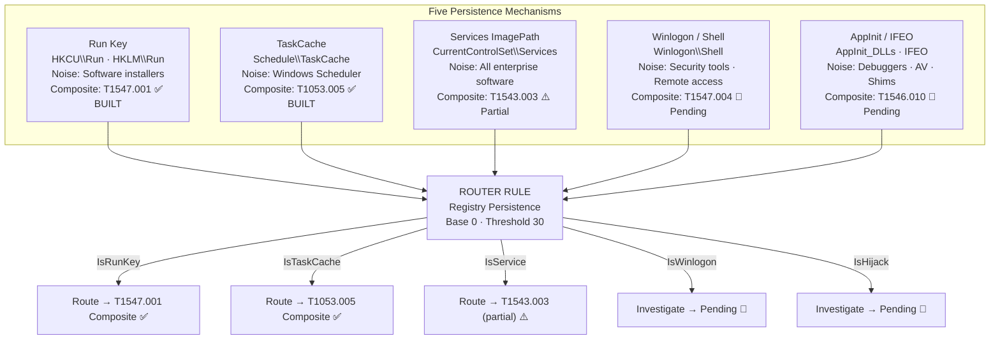

```kql
// ============================================================================
// ROUTER RULE 3: Registry Persistence Intent Surface
// Architecture : Router Rule — Triage Surface
// Author       : Ala Dabat | MTDF 2026
// Lifecycle    : Router (Temporary)
// Platform     : MDE Advanced Hunting
//
// DECOMPOSITION STATUS:
// ┌──────────────────────┬─────────────────────────────┬──────────────────────┐
// │ Technique            │ Composite Status             │ Action               │
// ├──────────────────────┼─────────────────────────────┼──────────────────────┤
// │ Run Key \Run         │ T1547.001 — BUILT ✅         │ Route to composite   │
// │ TaskCache silent     │ T1053.005 — BUILT ✅         │ Route to composite   │
// │ Services ImagePath   │ T1543.003 — partial ⚠️       │ Route + investigate  │
// │ Winlogon / Shell     │ T1547.004 — pending 🔴       │ Keep, investigate    │
// │ AppInit / IFEO       │ T1546.010 — pending 🔴       │ Keep, investigate    │
// └──────────────────────┴─────────────────────────────┴──────────────────────┘
// ============================================================================

let lookback = 7d;
let RunKeys      = dynamic([
    @"software\microsoft\windows\currentversion\run",
    @"software\microsoft\windows\currentversion\runonce"
]);
let WinlogonKeys = dynamic([
    @"software\microsoft\windows nt\currentversion\winlogon"
]);
let TaskCacheKeys = dynamic([
    @"software\microsoft\windows nt\currentversion\schedule\taskcache\tree",
    @"software\microsoft\windows nt\currentversion\schedule\taskcache\tasks"
]);
let ServiceKeys  = dynamic([
    @"system\currentcontrolset\services"
]);
let HijackKeys   = dynamic([
    @"software\microsoft\windows nt\currentversion\image file execution options",
    @"software\microsoft\windows nt\currentversion\windows\appinit_dlls"
]);
let DangerTokens = dynamic([
    "powershell","pwsh","cmd.exe","mshta","wscript","cscript",
    "rundll32","regsvr32","certutil","bitsadmin","curl",
    "-enc","-encodedcommand","frombase64string","iex",
    "http:","https:","\\AppData\\","\\Temp\\","\\ProgramData\\"
]);
let TrustedWriters = dynamic([
    "msiexec.exe","trustedinstaller.exe","setup.exe",
    "intunemanagementextension.exe"
]);

// ── PHASE 1: BROAD SURFACE FILTER ──────────────────────────────────────────
DeviceRegistryEvents
| where Timestamp > ago(lookback)
| where ActionType == "RegistryValueSet"
| extend RKL = tolower(tostring(RegistryKey))
| where RKL has_any (RunKeys) or RKL has_any (WinlogonKeys)
    or RKL has_any (TaskCacheKeys) or RKL has_any (ServiceKeys)
    or RKL has_any (HijackKeys)

// ── PHASE 2: SIGNAL ENRICHMENT ──────────────────────────────────────────────
| extend
    IsRunKey        = toint(RKL has_any (RunKeys)),
    IsWinlogon      = toint(RKL has_any (WinlogonKeys)),
    IsTaskCache     = toint(RKL has_any (TaskCacheKeys)),
    IsService       = toint(RKL has_any (ServiceKeys)),
    IsHijack        = toint(RKL has_any (HijackKeys)),
    HasDanger       = toint(tolower(tostring(RegistryValueData))
                        has_any (DangerTokens)),
    HasBase64       = toint(RegistryValueData matches regex
                        @"(?:[A-Za-z0-9+/]{20,}={0,2})(?:\s+[A-Za-z0-9+/]{20,}={0,2})+"),
    HasRemoteURL    = toint(RegistryValueData matches regex @"https?://[^\s]+"),
    IsLargeBlob     = toint(strlen(RegistryValueData) > 500),
    IsTrustedWriter = toint(InitiatingProcessFileName in~ (TrustedWriters))

// ── PHASE 3: ROUTING SCORE ──────────────────────────────────────────────────
| extend RawScore = 0
    + iff(IsHijack == 1,                        30, 0)
    + iff(IsTaskCache == 1,                     20, 0)
    + iff(IsWinlogon == 1,                      20, 0)
    + iff(HasDanger == 1,                       20, 0)
    + iff(HasBase64 == 1,                       15, 0)
    + iff(HasRemoteURL == 1,                    15, 0)
    + iff(IsLargeBlob == 1,                     10, 0)
    - iff(IsTrustedWriter == 1 and HasDanger == 0, 15, 0)
| extend RiskScore = iif(RawScore < 0, 0, RawScore)
| where RiskScore >= 30

// ── PHASE 4: ROUTING DIRECTIVE ──────────────────────────────────────────────
| extend RoutingDirective = case(
    IsHijack == 1 and HasDanger == 1,
        "CRITICAL → T1546.010 AppInit/IFEO | Payload in hijack key | Pending composite",
    IsTaskCache == 1,
        "HIGH → T1053.005 TaskCache Composite | Composite built — run it now",
    IsRunKey == 1 and HasDanger == 1,
        "HIGH → T1547.001 Run Key Composite | Composite built — run it now",
    IsWinlogon == 1 and HasDanger == 1,
        "HIGH → T1547.004 Winlogon | Shell handler modified | Pending composite",
    IsService == 1 and HasDanger == 1,
        "HIGH → T1543.003 Services | ImagePath with payload | Partial composite",
    HasBase64 == 1,
        "MEDIUM → Encoded payload in persistence key | Decode and investigate",
    "MEDIUM → Registry persistence surface | Review writer + value context"
)
| summarize arg_max(Timestamp, *) by DeviceId, AccountName
| project Timestamp, DeviceName, AccountName,
          RegistryKey, RegistryValueName, RegistryValueData,
          InitiatingProcessFileName, RiskScore,
          IsRunKey, IsTaskCache, IsService, IsWinlogon, IsHijack,
          HasDanger, HasBase64, RoutingDirective
| sort by RiskScore desc
```

---

## Part VIII — Router Rule 4: Lateral Movement Surface

**Adversary goal:** Move from one host to another within the network.  
**Why a router rule:** SMB, WMI, WinRM, and DCOM all achieve lateral movement but operate on different ports, different protocols, different administrative tooling, and different detection surfaces.

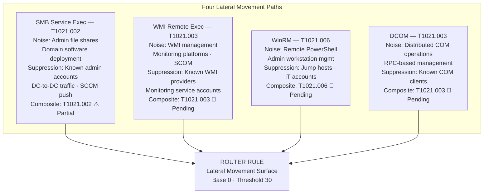

```kql
// ============================================================================
// ROUTER RULE 4: Lateral Movement Surface
// Architecture : Router Rule — Triage Surface
// Author       : Ala Dabat | MTDF 2026
// Lifecycle    : Router (Temporary)
// Platform     : MDE Advanced Hunting
//
// DECOMPOSITION STATUS:
// ┌──────────────────────┬─────────────────────────────┬──────────────────────┐
// │ Technique            │ Composite Status             │ Action               │
// ├──────────────────────┼─────────────────────────────┼──────────────────────┤
// │ SMB service exec     │ T1021.002 — partial ⚠️       │ Route + investigate  │
// │ WMI remote exec      │ T1021.003 — pending 🔴       │ Keep in router       │
// │ WinRM remote exec    │ T1021.006 — pending 🔴       │ Keep in router       │
// │ DCOM execution       │ T1021.003 variant — pending  │ Keep in router       │
// └──────────────────────┴─────────────────────────────┴──────────────────────┘
// ============================================================================

let lookback = 7d;
// Lateral movement execution parents
let LateralParents = dynamic([
    "services.exe",     // SMB service execution
    "WmiPrvSE.exe",     // WMI remote execution
    "wsmprovhost.exe",  // WinRM execution
    "mmc.exe",          // DCOM MMC abuse
    "dllhost.exe"       // DCOM host
]);
// Children that are anomalous from these parents
let SuspiciousChildren = dynamic([
    "cmd.exe","powershell.exe","pwsh.exe","mshta.exe",
    "wscript.exe","cscript.exe","certutil.exe","bitsadmin.exe",
    "net.exe","net1.exe","whoami.exe","ipconfig.exe",
    "nltest.exe","dsquery.exe","reg.exe"
]);
// Known safe management accounts — soft down-score not exclusion
let KnownAdminPatterns = dynamic([
    "sccm","scom","monitoring","backup","scan"
]);

// ── PHASE 1: BROAD SURFACE FILTER ──────────────────────────────────────────
DeviceProcessEvents
| where Timestamp > ago(lookback)
| where InitiatingProcessFileName in~ (LateralParents)
| where FileName in~ (SuspiciousChildren)

// ── PHASE 2: SIGNAL ENRICHMENT ──────────────────────────────────────────────
| extend
    // Identify lateral movement mechanism
    IsSMBExec   = toint(InitiatingProcessFileName =~ "services.exe"),
    IsWMIExec   = toint(InitiatingProcessFileName =~ "WmiPrvSE.exe"),
    IsWinRM     = toint(InitiatingProcessFileName =~ "wsmprovhost.exe"),
    IsDCOM      = toint(InitiatingProcessFileName in~ ("mmc.exe","dllhost.exe")),
    // Escalation signals
    HasEncoded  = toint(ProcessCommandLine has_any (
                    "-enc","-encodedcommand","frombase64string","iex")),
    HasNetwork  = toint(ProcessCommandLine has_any ("http://","https://")),
    HasRecon    = toint(FileName in~ (
                    "whoami.exe","ipconfig.exe","nltest.exe",
                    "dsquery.exe","net.exe","net1.exe")),
    IsAdminAcct = toint(AccountName has_any (KnownAdminPatterns))

// ── PHASE 3: ROUTING SCORE ──────────────────────────────────────────────────
| extend RawScore = 0
    + iff(IsWMIExec == 1,    25, 0)   // WMI remote child — strong signal
    + iff(IsWinRM == 1,      25, 0)   // WinRM child — strong signal
    + iff(IsSMBExec == 1,    20, 0)   // SMB service child — moderate
    + iff(IsDCOM == 1,       20, 0)   // DCOM child — moderate
    + iff(HasEncoded == 1,   20, 0)   // Encoded command — escalation
    + iff(HasNetwork == 1,   15, 0)   // Network call from lateral child
    + iff(HasRecon == 1,     10, 0)   // Reconnaissance activity
    - iff(IsAdminAcct == 1,  15, 0)   // Known admin account — soft penalty
| extend RiskScore = iif(RawScore < 0, 0, RawScore)
| where RiskScore >= 30

// ── PHASE 4: ROUTING DIRECTIVE ──────────────────────────────────────────────
| extend RoutingDirective = case(
    IsWMIExec == 1,
        "HIGH → T1021.003 WMI Exec Composite | Pending — investigate WmiPrvSE child",
    IsWinRM == 1,
        "HIGH → T1021.006 WinRM Exec Composite | Pending — investigate wsmprovhost child",
    IsSMBExec == 1,
        "HIGH → T1021.002 SMB Service Exec | Partial composite — pivot to services.exe child",
    IsDCOM == 1,
        "HIGH → T1021.003 DCOM variant | Pending — investigate COM host child spawn",
    "MEDIUM → Lateral movement surface — identify mechanism and pivot"
)
| summarize arg_max(Timestamp, *) by DeviceId, AccountName
| project Timestamp, DeviceName, AccountName,
          FileName, ProcessCommandLine,
          InitiatingProcessFileName,
          RiskScore, IsSMBExec, IsWMIExec, IsWinRM, IsDCOM,
          HasEncoded, HasRecon, RoutingDirective
| sort by RiskScore desc
```

---

## Part IX — Router Rule 5: Defense Evasion Surface

**Adversary goal:** Disable, bypass, or circumvent defensive controls.  
**Why a router rule:** Security product tampering, exclusion abuse, and ETW/AMSI bypass all defeat defenses but operate on entirely different telemetry surfaces and require different suppression — security products legitimately touch all of these.

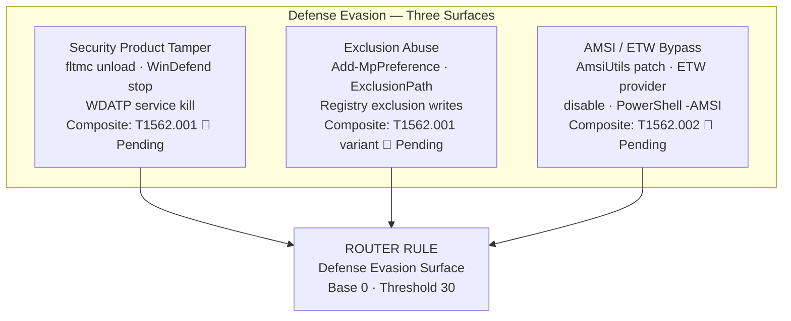

```kql
// ============================================================================
// ROUTER RULE 5: Defense Evasion Surface
// Architecture : Router Rule — Triage Surface
// Author       : Ala Dabat | MTDF 2026
// Lifecycle    : Router (Temporary)
// Platform     : MDE Advanced Hunting
//
// DECOMPOSITION STATUS:
// ┌──────────────────────┬─────────────────────────────┬──────────────────────┐
// │ Technique            │ Composite Status             │ Action               │
// ├──────────────────────┼─────────────────────────────┼──────────────────────┤
// │ Security product kill│ T1562.001 — pending 🔴       │ Keep in router       │
// │ Exclusion path add   │ T1562.001 variant — pending  │ Keep in router       │
// │ AMSI bypass          │ T1562.002 — pending 🔴       │ Keep in router       │
// │ ETW provider disable │ T1562.006 — pending 🔴       │ Keep in router       │
// └──────────────────────┴─────────────────────────────┴──────────────────────┘
// ============================================================================

let lookback = 7d;
// Security products and their service names
let SecurityProducts = dynamic([
    "WinDefend","WdNisSvc","Sense","MDCoreSvc",
    "MsSense","mssecflt","WdFilter"
]);
// Tampering primitives
let TamperPrims = dynamic([
    "fltmc","sc stop","sc delete","sc config",
    "net stop","taskkill","kill"
]);

// ── PHASE 1A: PROCESS — Tampering and Bypass ───────────────────────────────
let ProcessEvents =
    DeviceProcessEvents
    | where Timestamp > ago(lookback)
    | where ProcessCommandLine has_any (
        // Security product tampering
        "fltmc","sc stop","sc delete","net stop",
        "WinDefend","WdNisSvc","Sense","MsSense",
        // AMSI bypass primitives
        "AmsiUtils","amsiInitFailed","amsi.dll",
        // ETW provider disable
        "AutoLogger","EventLog","ETW",
        // Exclusion abuse
        "Add-MpPreference","ExclusionPath","ExclusionProcess",
        "Set-MpPreference","DisableRealtimeMonitoring"
    )
    | extend Surface = "Process";

// ── PHASE 1B: REGISTRY — Exclusion and Config Tampering ────────────────────
let RegistryEvents =
    DeviceRegistryEvents
    | where Timestamp > ago(lookback)
    | where ActionType == "RegistryValueSet"
    | where RegistryKey has_any (
        @"windows defender\exclusions",
        @"windows defender\real-time protection",
        @"windows defender\features",
        @"windows advanced threat protection"
    )
    | extend Surface = "Registry",
             ProcessCommandLine = tostring(RegistryValueData),
             FileName = InitiatingProcessFileName;

// ── UNION SURFACES ──────────────────────────────────────────────────────────
union ProcessEvents, RegistryEvents

// ── PHASE 2: SIGNAL ENRICHMENT ──────────────────────────────────────────────
| extend
    IsTamper    = toint(ProcessCommandLine has_any (TamperPrims)
                    and ProcessCommandLine has_any (SecurityProducts)),
    IsExclusion = toint(ProcessCommandLine has_any (
                    "Add-MpPreference","ExclusionPath","ExclusionProcess",
                    "Set-MpPreference","DisableRealtimeMonitoring")),
    IsAMSI      = toint(ProcessCommandLine has_any (
                    "AmsiUtils","amsiInitFailed","amsi.dll",
                    "[Ref].Assembly","GetType")),
    IsETW       = toint(ProcessCommandLine has_any (
                    "AutoLogger","NtTraceControl","EtwEventWrite")),
    // Elevated process doing the tampering = higher confidence
    IsElevated  = toint(InitiatingProcessIntegrityLevel in ("High","System"))

// ── PHASE 3: ROUTING SCORE ──────────────────────────────────────────────────
| extend RawScore = 0
    + iff(IsTamper == 1,    40, 0)   // Direct product kill — highest priority
    + iff(IsExclusion == 1, 30, 0)   // Exclusion path abuse
    + iff(IsAMSI == 1,      25, 0)   // AMSI bypass
    + iff(IsETW == 1,       25, 0)   // ETW provider tampering
    + iff(IsElevated == 1,  10, 0)   // Elevated context amplifies
| extend RiskScore = iif(RawScore < 0, 0, RawScore)
| where RiskScore >= 30

// ── PHASE 4: ROUTING DIRECTIVE ──────────────────────────────────────────────
| extend RoutingDirective = case(
    IsTamper == 1,
        "CRITICAL → T1562.001 Security Product Tamper | Service kill confirmed | Pending composite — ISOLATE",
    IsExclusion == 1,
        "HIGH → T1562.001 Exclusion Abuse | Exclusion path added | Pending composite",
    IsAMSI == 1,
        "HIGH → T1562.002 AMSI Bypass | Script engine bypass detected | Pending composite",
    IsETW == 1,
        "HIGH → T1562.006 ETW Disable | Telemetry blinding attempt | Pending composite",
    "MEDIUM → Defense evasion surface | Investigate context"
)
| summarize arg_max(Timestamp, *) by DeviceId, AccountName
| project Timestamp, DeviceName, AccountName,
          FileName, ProcessCommandLine, Surface,
          RiskScore, IsTamper, IsExclusion, IsAMSI, IsETW,
          RoutingDirective
| sort by RiskScore desc
```

---

## Part X — Router Rule 6: Cloud Identity Abuse Surface

**Adversary goal:** Abuse cloud identity constructs — consent grants, token theft, OAuth abuse — to gain persistent access to cloud resources.  
**Why a router rule:** OAuth consent abuse, token replay, and service principal abuse all target cloud identity but use completely different APIs, produce different audit log events, and require different suppression (legitimate app registrations, developer OAuth flows, and MSP service principals all look similar to attacks).

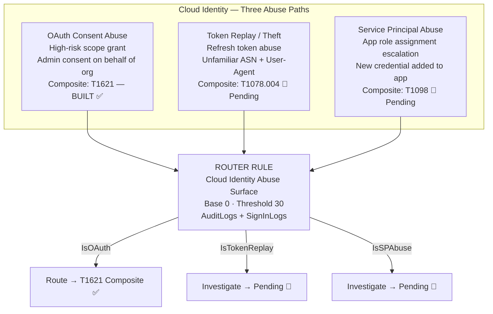

```kql
// ============================================================================
// ROUTER RULE 6: Cloud Identity Abuse Surface
// Architecture : Router Rule — Triage Surface
// Author       : Ala Dabat | MTDF 2026
// Lifecycle    : Router (Temporary)
// Platform     : Microsoft Sentinel (AuditLogs + SigninLogs)
//
// DECOMPOSITION STATUS:
// ┌──────────────────────┬─────────────────────────────┬──────────────────────┐
// │ Technique            │ Composite Status             │ Action               │
// ├──────────────────────┼─────────────────────────────┼──────────────────────┤
// │ OAuth consent abuse  │ T1621 Composite — BUILT ✅   │ Route to composite   │
// │ Token replay / theft │ T1078.004 — pending 🔴       │ Keep in router       │
// │ Service principal    │ T1098 — pending 🔴            │ Keep in router       │
// └──────────────────────┴─────────────────────────────┴──────────────────────┘
// ============================================================================

let lookback = 7d;
let HighRiskScopes = dynamic([
    "Mail.ReadWrite","Directory.ReadWrite.All",
    "AppRoleAssignment.ReadWrite.All",
    "RoleManagement.ReadWrite.Directory",
    "Files.ReadWrite.All","Sites.FullControl.All",
    "User.ReadWrite.All","Group.ReadWrite.All"
]);

// ── PHASE 1A: AUDIT LOGS — Consent and App Changes ─────────────────────────
let AuditSignals =
    AuditLogs
    | where TimeGenerated > ago(lookback)
    | where OperationName in~ (
        "Consent to application",
        "Add delegated permission grant",
        "Add app role assignment grant to service principal",
        "Add service principal credentials",
        "Add application",
        "Update application"
    )
    | where Result =~ "success"
    | extend Surface = "AuditLog",
             ActorUPN = tostring(InitiatedBy.user.userPrincipalName),
             TargetApp = tostring(TargetResources[0].displayName),
             PermissionsGranted = tostring(TargetResources[0].modifiedProperties);

// ── PHASE 1B: SIGNIN LOGS — Token Replay Signals ───────────────────────────
let SignInSignals =
    SigninLogs
    | where TimeGenerated > ago(lookback)
    | where ResultType == 0   // Successful sign-in
    | extend Surface = "SignIn"
    | summarize
        UniqueCities   = dcount(LocationDetails),
        UniqueASNs     = dcount(tostring(NetworkLocationDetails)),
        UniqueUAs      = dcount(UserAgent),
        SignInCount    = count(),
        FirstSeen      = min(TimeGenerated)
      by UserPrincipalName, AppDisplayName
    | where UniqueCities > 2 or UniqueASNs > 3 or UniqueUAs > 4
    | extend TargetApp = AppDisplayName, ActorUPN = UserPrincipalName,
             PermissionsGranted = "";

// ── UNION AND ENRICH ────────────────────────────────────────────────────────
union AuditSignals, SignInSignals
| extend
    IsOAuthConsent  = toint(Surface == "AuditLog"
                        and OperationName has "Consent"),
    IsHighRiskScope = toint(PermissionsGranted has_any (HighRiskScopes)),
    IsAdminConsent  = toint(PermissionsGranted has "AllPrincipals"),
    IsNewCred       = toint(OperationName has "credentials"),
    IsTokenReplay   = toint(Surface == "SignIn"),
    IsSPChange      = toint(OperationName has "service principal")

// ── PHASE 3: ROUTING SCORE ──────────────────────────────────────────────────
| extend RawScore = 0
    + iff(IsHighRiskScope == 1, 35, 0)
    + iff(IsAdminConsent == 1,  30, 0)
    + iff(IsNewCred == 1,       25, 0)
    + iff(IsTokenReplay == 1,   20, 0)
    + iff(IsOAuthConsent == 1,  15, 0)
    + iff(IsSPChange == 1,      15, 0)
| extend RiskScore = iif(RawScore < 0, 0, RawScore)
| where RiskScore >= 30

// ── PHASE 4: ROUTING DIRECTIVE ──────────────────────────────────────────────
| extend RoutingDirective = case(
    IsOAuthConsent == 1 and IsHighRiskScope == 1,
        "CRITICAL → T1621 OAuth Consent Composite | High-risk scope granted | Composite built — run it",
    IsAdminConsent == 1,
        "CRITICAL → T1621 OAuth Consent Composite | Admin consent on behalf of org | Run composite",
    IsNewCred == 1,
        "HIGH → T1098 Service Principal Composite | New credential added | Pending composite",
    IsTokenReplay == 1,
        "HIGH → T1078.004 Token Replay Composite | Anomalous sign-in pattern | Pending composite",
    IsSPChange == 1,
        "MEDIUM → T1098 Service Principal | SP modified | Investigate scope and actor",
    "MEDIUM → Cloud identity surface | Investigate actor and application"
)
| project TimeGenerated, ActorUPN, TargetApp, Surface,
          RiskScore, IsOAuthConsent, IsHighRiskScope,
          IsAdminConsent, IsNewCred, IsTokenReplay,
          RoutingDirective
| sort by RiskScore desc
```

---

## Part XI — The Decomposition Pipeline

### Master Decomposition Tracker — All Six Router Rules

| Router Rule | Technique | Composite | Status | Action |
|-------------|-----------|-----------|--------|--------|
| Ingress Transfer | bitsadmin /transfer | T1197 BITSAdmin | ✅ Built | **RETIRE** |
| Ingress Transfer | PowerShell cradle | T1059.001 PowerShell | ✅ Built | **RETIRE** |
| Ingress Transfer | certutil -urlcache | T1140 Certutil | 🔴 Pending | Keep |
| Ingress Transfer | curl / wget | T1105 curl | 🔴 Not built | Keep |
| Ingress Transfer | ftp / tftp | None | 🔴 Not planned | Keep |
| Ingress Transfer | IsMasqueraded | T1036 Masquerade | 🔴 Pending | Keep |
| LOLBin Proxy | rundll32.exe | T1218.011 | 🔴 Pending | Keep |
| LOLBin Proxy | regsvr32.exe | T1218.010 | 🔴 Pending | Keep |
| LOLBin Proxy | mshta.exe | T1218.005 | 🔴 Pending | Keep |
| Registry Persistence | Run key | T1547.001 | ✅ Built | **Route to composite** |
| Registry Persistence | TaskCache | T1053.005 | ✅ Built | **Route to composite** |
| Registry Persistence | Services ImagePath | T1543.003 | ⚠️ Partial | Route + investigate |
| Registry Persistence | Winlogon/Shell | T1547.004 | 🔴 Pending | Keep |
| Registry Persistence | AppInit/IFEO | T1546.010 | 🔴 Pending | Keep |
| Lateral Movement | SMB service exec | T1021.002 | ⚠️ Partial | Route + investigate |
| Lateral Movement | WMI remote exec | T1021.003 | 🔴 Pending | Keep |
| Lateral Movement | WinRM exec | T1021.006 | 🔴 Pending | Keep |
| Lateral Movement | DCOM execution | T1021.003v | 🔴 Pending | Keep |
| Defense Evasion | Security product kill | T1562.001 | 🔴 Pending | Keep |
| Defense Evasion | Exclusion abuse | T1562.001v | 🔴 Pending | Keep |
| Defense Evasion | AMSI bypass | T1562.002 | 🔴 Pending | Keep |
| Defense Evasion | ETW disable | T1562.006 | 🔴 Pending | Keep |
| Cloud Identity | OAuth consent | T1621 | ✅ Built | **Route to composite** |
| Cloud Identity | Token replay | T1078.004 | 🔴 Pending | Keep |
| Cloud Identity | Service principal | T1098 | 🔴 Pending | Keep |

### The Decomposition Lifecycle

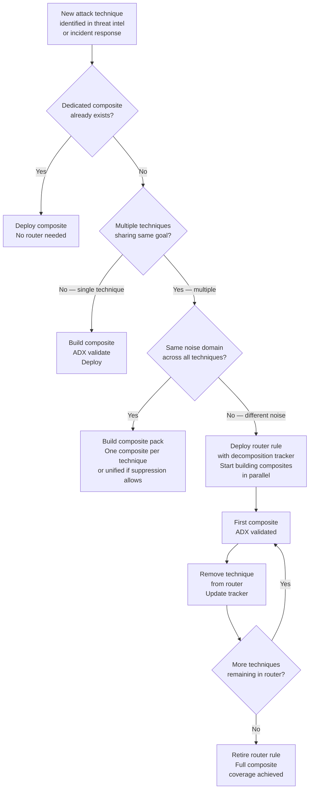

---

## Part XII — Router Rule Checklist

Before publishing any router rule, every item must be confirmed.

| Requirement | Specification | Check |
|-------------|--------------|-------|
| Architecture declared | Header clearly states ROUTER RULE — Triage Surface | ✅ |
| Base score | Exactly 0 — never 55 | ✅ |
| Threshold | ≤ 30 — never ≥ 75 | ✅ |
| Decomposition tracker | Table present with all techniques, composites, and actions | ✅ |
| RoutingDirective | Per-technique routing, not a HunterDirective | ✅ |
| arg_max | Replaces any() in all summarise blocks | ✅ |
| Hard exclusions | None — soft down-score penalties only | ✅ |
| Retirement comment | TEMPORARY — documents which composites replace each technique | ✅ |
| Lifecycle state | Router (Temporary) in rule header | ✅ |
| Phase 4 labelled | ROUTING DIRECTIVE not HUNTER DIRECTIVE | ✅ |

### The Non-Negotiable Scoring Rules

```
ROUTER RULE:     Base = 0   ALWAYS. Threshold = ≤ 30 ALWAYS.
COMPOSITE SENSOR: Base = 55  ALWAYS. Threshold = ≥ 75 ALWAYS.

Violating either:
Router at 55   → Cannot be tuned. Scores are not comparable across techniques.
Composite at 0 → The minimum truth is not acknowledged. The rule has no anchor.
```

---

```
╔══════════════════════════════════════════════════════════════════════════════╗
║                    ROUTER RULE FRAMEWORK — FINAL PRINCIPLE                  ║
║                                                                              ║
║  Router rules exist because composites take time to build.                  ║
║  They are legitimate, engineered, and architecturally sound.                ║
║  They are never permanent.                                                   ║
║                                                                              ║
║  The noise domain is the deciding factor — not technique count.             ║
║  One suppression model across all techniques → composite.                   ║
║  Different suppression model per technique → router rule.                   ║
║                                                                              ║
║  The decomposition tracker is not bureaucracy.                              ║
║  It is the engineering commitment that makes the router rule legitimate.    ║
║                                                                              ║
║  Router rules detect intent.                                                 ║
║  Ecosystem composites confirm truth.                                         ║
║  The incident layer narrates the story.                                      ║
║  The pivot is not a defence. It is a data point.                            ║
╚══════════════════════════════════════════════════════════════════════════════╝
```

---

*Author: Ala Dabat | [github.com/azdabat](https://github.com/azdabat)*  
*Parent Framework: [Minimum Truth Detection Framework](https://github.com/azdabat/Minimum-Truth-Detection-Framework-ADX-Validated-Composite-Rules)*  
*Licensed under [CC BY-NC-SA 4.0](https://creativecommons.org/licenses/by-nc-sa/4.0/legalcode)*
