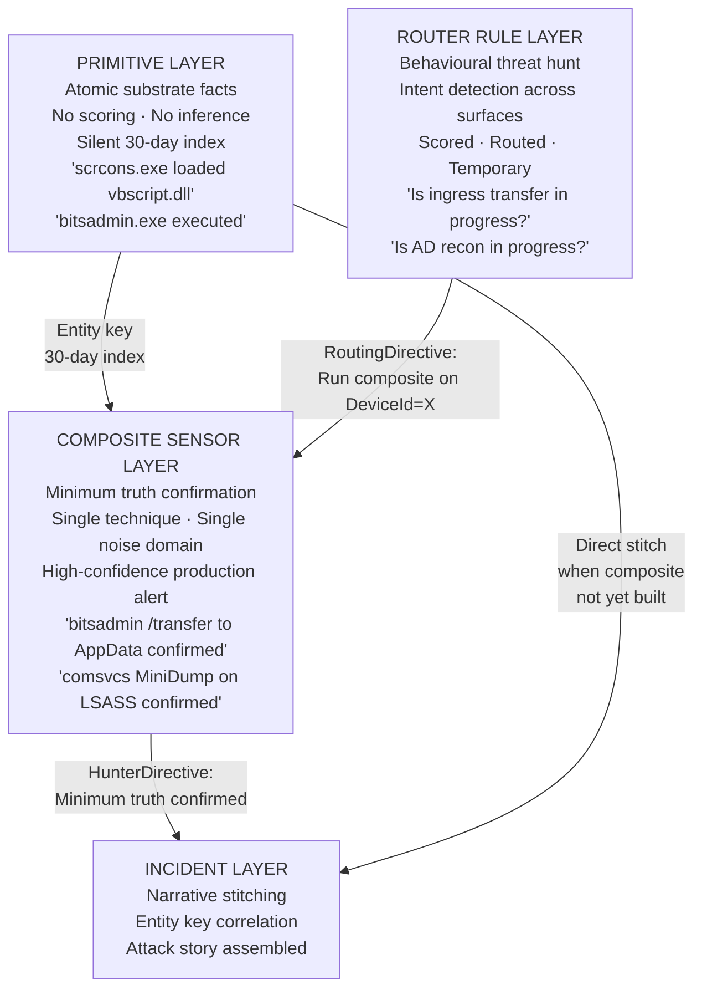
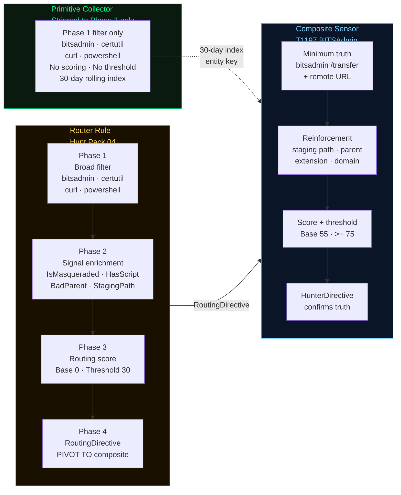
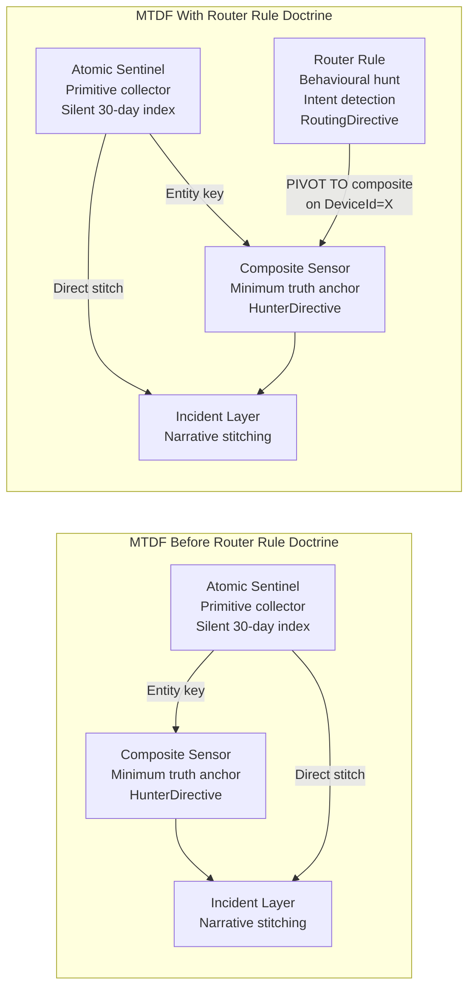
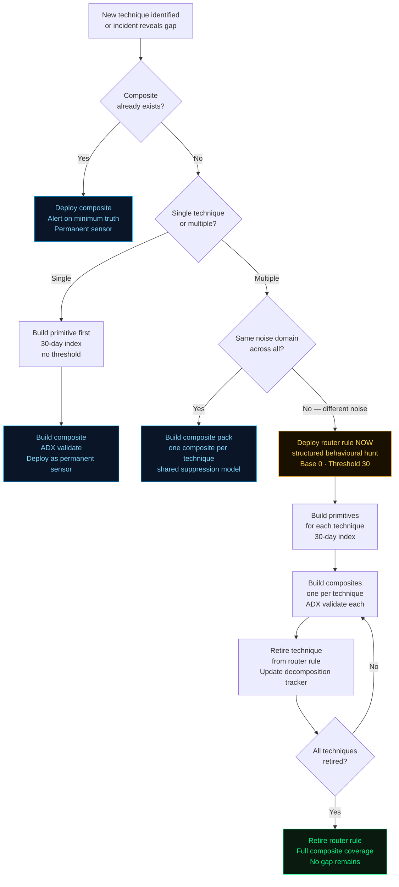

## Router Rules vs Primitives — The Three-Layer Detection Architecture

> *"A primitive captures what happened.*  
> *A router rule asks whether it matters.*  
> *A composite confirms that it does."*

---

### Primitives Are Atomic

A primitive is the irreducible telemetric fact. It answers one question with zero inference:

```
scrcons.exe loaded vbscript.dll
bitsadmin.exe executed
rundll32.exe invoked comsvcs.dll
```

No scoring. No context. No intent. Just the raw substrate event captured and indexed. Primitives live in the **atomic sentinel layer** — the silent 30-day rolling index that catches what composites miss and connects Day 0 staging to Day 3 activation.

---

### Router Rules Are Behavioural Threat Hunts

A router rule is a behavioural hunt that has been given structure, a scoring model, and a routing output. It asks a higher-order question than a primitive:

```
Is there evidence of ingress transfer intent anywhere on this estate?
Is there evidence of AD reconnaissance activity anywhere on this estate?
Is there evidence of script proxy execution intent anywhere on this estate?
```

These are hunt hypotheses expressed as always-on rules. The four-phase MTDF structure, the convergence scoring, the soft penalties, the routing directive — all of that is behavioural analysis, not raw telemetry capture. A router rule is operationally a threat hunt that has been promoted to a scheduled detection.

---

### The Three-Layer Model



---

### The Practical Distinction

| Layer | Question Asked | Output | Lifecycle |
|-------|---------------|--------|-----------|
| **Primitive** | Did this substrate event exist? | Raw indexed fact | Permanent |
| **Router Rule** | Is this adversary goal in progress? | RoutingDirective | Temporary |
| **Composite Sensor** | Did this specific attack happen? | HunterDirective | Permanent |
| **Incident Layer** | What is the full attack story? | Narrative + blast radius | Case lifecycle |

---

### What Happens When You Strip a Router Rule Down

Strip the scoring, remove the routing, remove the phase structure, keep only the Phase 1 filter — you get a primitive collector. That is literally what the atomic sentinel layer is built from.

The Phase 1 broad surface filter of Hunt Pack 04 (Ingress Tool Transfer), run with no threshold and no scoring, becomes a primitive index of every LOLBin downloader execution on the estate for the last 30 days.



That is architecturally valid and useful — but it serves a different purpose. The primitive index is the net. The router rule is the structured hunt. The composite is the anchor.

---

### The Insight That Connects All Three

The MTDF framework already implicitly contained all three layers:



The router rule fills the **gap between primitive and composite** — it is the structured behavioural hunt that surfaces intent across technique families while the composites are being built to confirm truth.

---

### The Coverage Pipeline in Full



---

### Summary

```
Primitive    → the substrate event, indexed, no inference
Router Rule  → the behavioural hunt, structured, intent-level, temporary
Composite    → the minimum truth confirmation, permanent, high-confidence
Incident     → the narrative, assembled from all three

Strip a router rule to Phase 1 only → primitive collector
Promote a router rule technique to ADX-validated anchor → composite sensor
A router rule that is never retired → coverage debt
A composite without a primitive backing it → gap in the 30-day index
```

> **The primitive is the net.**  
> **The router rule is the structured hunt.**  
> **The composite is the anchor.**  
> **The incident is the story.**
